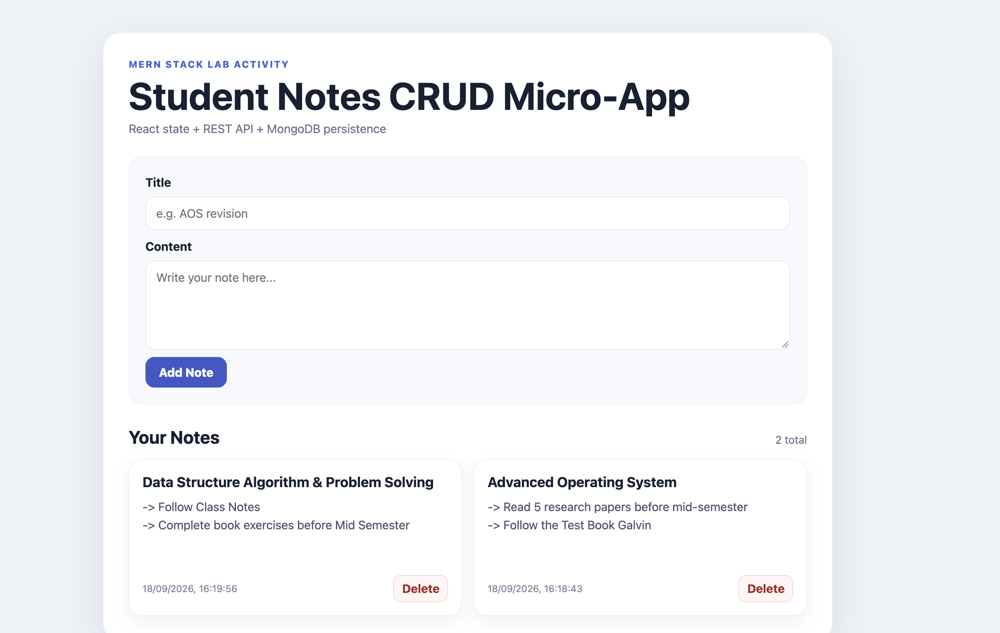
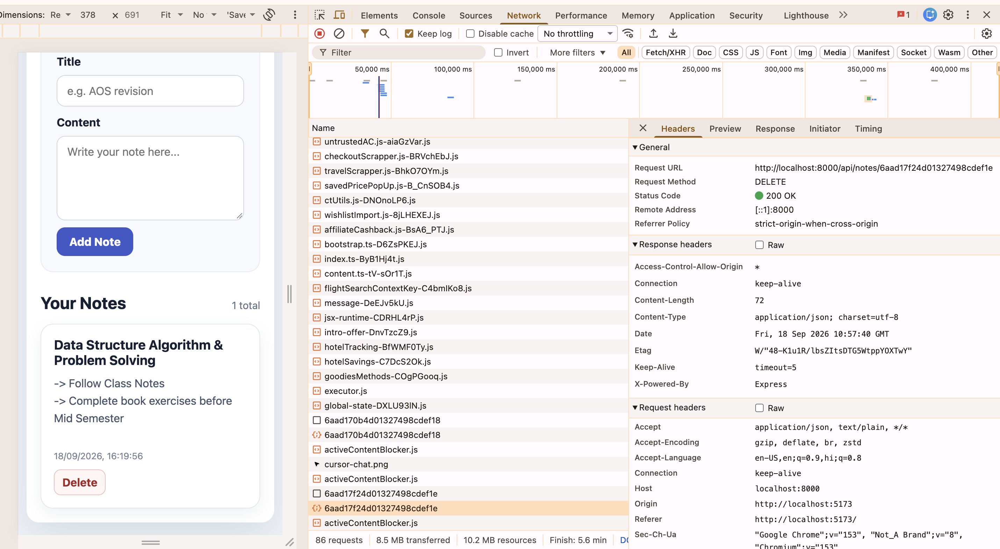

# Student Notes CRUD Micro-App — MERN Lab

## Candidate Details
- **Name:** ANANT PREET SINGH REEN
- **Roll No.:** 2026201026
- **Lab Assignment 4:** MERN Stack Lab Activity
- **GitHub Repository:** https://github.com/anantreen/MERN-Stack-Lab-Assignment4

## Objective
This project is a decoupled MERN notes application demonstrating React state management, RESTful API design, asynchronous MongoDB persistence through Mongoose, CORS-enabled client/server communication, and immediate UI reconciliation after create/delete operations.

## Required Data Model
Each MongoDB document follows this schema:

```js
{
  title: String,      // required
  content: String,    // required
  createdAt: Date     // default Date.now
}
```

## Project Structure

```text
notes-app/
├── .gitignore
├── README.md
├── screenshots/
│   ├── ui-preview.png
│   └── delete-action.png
├── server/
│   ├── config/
│   │   └── db.js
│   ├── models/
│   │   └── Note.js
│   ├── routes/
│   │   └── noteRoutes.js
│   ├── package.json
│   └── server.js
└── client/
    ├── index.html
    ├── vite.config.js
    ├── package.json
    └── src/
        ├── App.jsx
        ├── main.jsx
        └── index.css
```

## API Endpoints

| Method | Endpoint | Purpose | Success Status |
|---|---|---|---|
| POST | `/api/notes` | Create a new note | `201 Created` |
| GET | `/api/notes` | Fetch all notes newest first | `200 OK` |
| DELETE | `/api/notes/:id` | Delete a note by MongoDB `_id` | `200 OK` |

If a DELETE target does not exist, the API returns `404 Not Found`.

## Prerequisites
- Node.js and npm
- MongoDB running locally on the default port
- Database URL used by this project: `mongodb://localhost:27017/notes_db`

## Setup and Run

### 1. Start MongoDB
Ensure your local MongoDB daemon is running on port `27017`.

### 2. Start the backend

```bash
cd server
npm install
npm start
```

Backend runs on:

```text
http://localhost:8000
```

### 3. Start the frontend
Open a second terminal:

```bash
cd client
npm install
npm run dev
```

Frontend runs on:

```text
http://localhost:5173
```

## Endpoint Smoke Tests

### Create a note

```bash
curl -X POST http://localhost:8000/api/notes \
  -H "Content-Type: application/json" \
  -d '{"title":"MERN Lab","content":"Testing note creation"}'
```

### Get all notes

```bash
curl http://localhost:8000/api/notes
```

### Delete a note
Replace `<NOTE_ID>` with an actual MongoDB `_id` returned by GET/POST.

```bash
curl -X DELETE http://localhost:8000/api/notes/<NOTE_ID>
```

## Implemented Functional Requirements
- Mongoose schema with required `title` and `content`
- `createdAt` defaults to `Date.now`
- Express server on port `8000`
- Explicit `cors()` middleware
- `express.json()` request-body parsing
- POST/GET/DELETE REST routes
- GET results sorted by `createdAt: -1`
- Controlled React form
- Axios for HTTP requests
- `useEffect` for initial data loading
- `useState` for local UI state
- Loading state
- Required empty state: **“No notes yet — add one above!”**
- Immediate UI update after create/delete without browser refresh
- Form resets after successful POST
- Localized note date display
- Defensive client/server error handling

## Screenshot Requirements Before Submission

1. `ui-preview.png` — browser view showing at least two rendered notes.



2. `delete-action.png` — browser view after deleting a note, with DevTools **Network** tab visibly showing a successful `200 OK` for `DELETE /api/notes/:id`.

